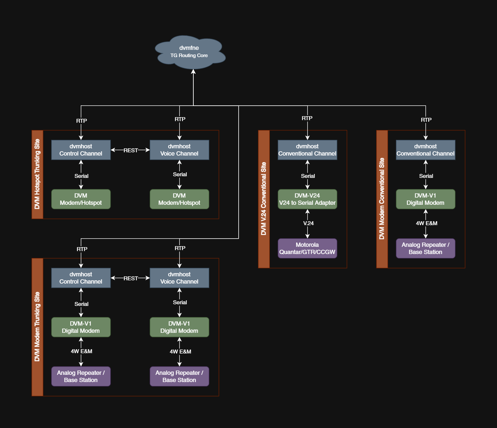

# Digital Voice Modem Core Software Suite

The Digital Voice Modem ("DVM") Core Software Suite, provides the a set of applications that:

- Act as a primary host computer implementation of a mixed-mode DMR, P25 and/or NXDN or dedicated-mode DMR, P25 or NXDN repeater system that talks to the actual air modem hardware, or for P25 mode, a TIA/V.24 standard interface mode allowing communications to commercial P25 hardware using the V.24 DFSI modem hardware or UDP. 
- Networking core (dvmfne) that provides a centralized network service that interconnects various DVM endpoint applications allowing networked communications.
- Analog <-> Digital and Digital <-> Digital (Transcoding) vocoding.

Please feel free to reach out to us for help, comments or otherwise, on our Discord: https://discord.gg/3pBe8xgrEz

This project suite generates a few executables:

### Core Applications

- `dvmhost` host software that connects to the DVM modems (both air interface for repeater and hotspot or P25 DFSI for commerical P25 hardware) and is the primary data processing application for digital modes. [See configuration](#dvmhost-configuration) to configure and calibrate.
- `dvmfne` a network "core", this provides a central server for `dvmhost` instances to connect to and be networked with, allowing relay of traffic and other data between `dvmhost` instances and other `dvmfne` instances. [See configuration](#dvmfne-configuration) to configure.
- `dvmbridge` a analog/PCM audio bridge, this provides the capability for analog or PCM audio resources to be connected to a `dvmfne` instance, allowing realtime vocoding of traffic. [See configuration](#dvmbridge-configuration) to configure.
- `dvmcmd` a simple command-line utility to send remote control commands to a `dvmhost` or `dvmfne` instance with REST API configured.

### Supplementary Support Applications

- `dvmmon` a TUI utility that allows semi-realtime console-based monitoring of `dvmhost` instances (this tool is only available when project wide TUI support is enabled!).
- `sysview` a TUI utility that allows near-realtime console-based monitoring of a `dvmfne` instance (this tool is only available when project wide TUI support is enabled!).
- `tged` a TUI utility that allows editing of talkgroup rules configuration files (this tool is only available when project wide TUI support is enabled!).
- `peered` a TUI utility that allows editing of peer list data files (this tool is only available when project wide TUI support is enabled!).



## Building

This project utilizes CMake for its build system. (All following information assumes familiarity with the standard Linux make system.)

The DVM Host software requires the library dependancies below. Generally, the software attempts to be as portable as possible and as library-free as possible. A basic GCC/G++ install, with libasio and ncurses is usually all that is needed to compile.

### Dependencies

`apt-get install libasio-dev libncurses-dev libssl-dev`

- ASIO Library (https://think-async.com/Asio/); on Debian/Ubuntu Linux's: `apt-get install libasio-dev`
- ncurses; on Debian/Ubuntu Linux's: `apt-get install libncurses-dev`
- OpenSSL; on Debian/Ubuntu Linux's: `apt-get install libssl-dev`

Alternatively, if you download the ASIO library from the ASIO website and extract it to a location, you can specify the path to the ASIO library using: `-DWITH_ASIO=/path/to/asio`. This method is required when cross-compiling for old Raspberry Pi ARM 32 bit.

If cross-compiling ensure you install the appropriate libraries, for example for AARCH64/ARM64:
```
sudo dpkg --add-architecture arm64
sudo apt-get update
sudo apt-get install libasio-dev:arm64 libncurses-dev:arm64 libssl-dev:arm64
```

### Build Instructions

1. Clone the repository. `git clone https://github.com/DVMProject/dvmhost.git`
2. Switch into the "dvmhost" folder. Create a new folder named "build" and switch into it.
   ```
   # cd dvmhost
   dvmhost # mkdir build
   dvmhost # cd build
   ```
3. Run CMake with any specific options required. (Where [options] is any various compilation options you require.)
   ```
   dvmhost/build # cmake [options] ..
   ...
   -- Build files have been written to: dvmhost/build
   dvmhost/build # make
   ```
4. [OPTIONAL] Install binaries (it is *highly* recommended to not run DVM out of the build folder).
    1. Tarball Install
        1. Run build finalization.
        ```
        dvmhost/build # make strip
        dvmhost/build # make tarball
        ```
        2. After `make tarball` completes file named `dvmhost_R04Gxx_<arch>.tar.gz` should be created. Run the following command to install:
        ```
        dvmhost/build # sudo tar xvzf dvmhost_R04Gxx_<arch>.tar.gz -C /opt
        ```
    2. old_install Install
        1. Run build finalization.
        ```
        dvmhost/build # make strip
        ```        
        2. Install build.
        ```
        dvmhost/build # sudo make old_install
        ```        

If cross-compiling is required (for either ARM 32bit, 64bit or old Raspberry Pi ARM 32bit), the CMake build system has some options:

- `-DCROSS_COMPILE_ARM=1` - This will cross-compile dvmhost for generic ARM 32bit. (RPi4 running 32-bit distro's can fall into this category [on Debian/Rasbpian anything bullseye or newer])
- `-DCROSS_COMPILE_AARCH64=1` - This will cross-compile dvmhost for generic ARM 64bit. (RPi4 running 64-bit distro's can fall into this category [on Debian/Rasbpian anything bullseye or newer])
- `-DCROSS_COMPILE_RPI_ARM=1` - This will cross-compile for old Raspberry Pi ARM 32 bit. (typically this will be the RPi1, 2 and 3 platforms; see build notes, linked below)

Please note cross-compliation requires you to have the appropriate development packages installed for your system. For ARM 32-bit, on Debian/Ubuntu OS install the "arm-linux-gnueabihf-gcc" and "arm-linux-gnueabihf-g++" packages. For ARM 64-bit, on Debian/Ubuntu OS install the "aarch64-linux-gnu-gcc" and "aarch64-linux-gnu-g++" packages.

[See project notes](#project-notes).

### Setup TUI (Text-based User Interface)

Since, DVM Host 3.5, the old calibration and setup modes have been deprecated in favor of a ncurses-based TUI. This TUI is optional, and DVM Host can still be compiled without it for systems or devices that cannot utilize it.

- `-DENABLE_SETUP_TUI=0` - This will disable the setup/calibration TUI interface.
- `-DENABLE_TUI_SUPPORT=0` - This will disable TUI support project wide. Any projects that require TUI support will not compile, or will have any TUI components disabled.

## dvmhost Configuration

This source repository contains configuration example files within the configs folder, please review `config.example.yml` for the `dvmhost` for details on various configurable options. When first setting up a DVM instance, it is important to properly set the channel "Identity Table" or "Logical Channel ID" (or LCN ID) data, within the `iden_table.dat` file and then calibrate the modem.

The `iden_table.dat` file contains critical information used by `dvmhost` (and some other related applications) to calculate frequencies for Rx/Tx, these calculations are used for over the air broadcast messages that direct radios to which frequency to tune to when in trunking mode. Additionally, the `iden_table.dat` frequency calculations are also used to determine what frequency a hotspot operates on.

There is a helper CLI Python tool called `iden-channel-calculator` (For more information please, see: https://github.com/DVMProject/iden-channel-calculator) to help calculate and generate `iden_table.dat` entries, along with determine which relative channel number relates to a specified frequency.

It should also be important to read and review the [calibration notes](#calibration-notes) below.

### Initial Setup Steps

The following setups assume the host is compiled with the setup TUI mode (if available) [NOTE: Steps 3 - 5 only apply to the air interface modem.]. It is possible to setup the modem without the setup TUI, and requires manually modifying `config.yml` and the `iden_table.dat` files.

1. Create/Edit `config.yml` and ensure the settings for the modem are correct, find the "modem" section in "system". Check that the uart settings have the appropriate UART port and port speed set (the config.yml defaults to /dev/ttyUSB0 and 115200).
    1. If using the air modem interface, ensure the the modem protocol mode is set to "air".
    2. If using the V.24 DFSI modem interface, ensure the modem protocol mode is set to "dfsi".
        1. The V.24 DFSI modem has multiple firmware revisions, it is required to use firmware version 2.0 or greater for use with dvmhost.
2. Start `dvmhost` as follows: `/path/to/dvmhost -c /path/to/config.yml --setup`. This will start the dvmhost setup TUI mode.
3. Using the TUI user interface, use the "Setup" menu to set default parameters.
    1. The "Logging & Data Configuration" submenu allows you to alter the various logging file paths and levels, as well as paths to data files (such as the `iden_table.dat` file).
    2. The "System Configuration" submenu allows you to alter various modem port and speed, system settings, and mode settings configuration.
    3. The "Site Parameters" submenu allows you to alter various CW morse identification, and site parameters.
    4. The "Channel Configuration" submenu allows you to alter the configured channel for the modem you are configuring.
4. After altering settings, use the "File" menu, "Save Settings" menu option to save the desired configuration.
5. Quit setup mode (some settings changes require a restart of the software to be effective) using, "File" menu, "Quit".

### (Air Interface) Transmit Calibration (using setup TUI, if available)

1. Start `dvmhost` as follows: `/path/to/dvmhost -c /path/to/config.yml --setup`. This will start the dvmhost setup TUI mode. The best way to calibrate the DVM is to use a radio from which you can receive and transmit the appropriate test patterns (for example using ASTRO25 Tuner and an XTS radio to use the "Bit Error Rate" functions under Performance Testing).
2. Depending on which protocol you are calibration with, use the "Calibrate" menu, and select the appropriate mode using the "Operational Mode" submenu. (For example, select [Tx] DMR BS 1031 Hz Test Pattern for DMR or [Tx] P25 1011 Hz Test Pattern (NAC293 ID1 TG1) for P25.)
3. Open the "Level Adjustment" window by either, using the "Calibrate" menu and selecting "Level Adjustment" or if capable, pressing F5 on the keyboard.
4. Ensure the TX Level is set to 50 (it should be by default, you can use the spinbox in the "Level Adjustment" window to change the value, if necessary to set it to 50).
5. If the hardware in use has a TX potentiometer, set it to the to minimum level.
6. Start Tx (click "Transmit" or press F12 on the keyboard).
7. While observing the BER via whatever means available, adjust the TX potentiometer (if the modem hardware allows) for the lowest received BER. Adjust the software TX Level for some fine tuning with the spinbox in the "Level Adjustment" window.
8. Stop Tx (click "Transmit" or press F12 on the keyboard).
9. After altering settings, use the "File" menu, "Save Settings" menu option to save the desired configuration.
10. Quit setup mode, if done doing calibration, using, "File" menu, "Quit".

### (Air Interface) Transmit Calibration (using old calibration CLI)

1. Start `dvmhost` as follows: `/path/to/dvmhost -c /path/to/config.yml --cal`. This will start the dvmhost calibration mode. The best way to calibrate the DVM is to use a radio from which you can receive and transmit the appropriate test patterns (for example using ASTRO25 Tuner and an XTS radio to use the "Bit Error Rate" functions under Performance Testing).
2. Depending on which protocol you are calibration with, enter DMR BS 1031 Hz Test Pattern (M) or P25 1011 Hz Test Pattern (NAC293 ID1 TG1) (P).
3. Ensure the TXLevel is set to 50 (it should be by default, "\`" will display current values, use "T" [increase] and "t" [decrease] if necessary to set it to 50).
4. If the hardware in use has a TX potentiometer, set it to the to minimum level.
5. Start Tx (press spacebar to toggle Tx).
6. While observing the BER via whatever means available, adjust the TX potentiometer (if the modem hardware allows) for the lowest received BER. Adjust the software TXLevel for some fine tuning with the "T" (increase) and "t" (decrease).
7. Stop Tx (press spacebar to toggle Tx).
8. Save the configuration using "s" and quit calibration mode with "q".

### (Air Interface) Receive Calibration (using setup TUI, if available)

1. Start `dvmhost` as follows: `/path/to/dvmhost -c /path/to/config.yml --setup`. This will start the dvmhost setup TUI mode. The best way to calibrate the DVM is to use a radio from which you can receive and transmit the appropriate test patterns (for example using ASTRO25 Tuner and an XTS radio to use the "Transmitter Test Pattern" functions under Performance Testing).
2. Depending on which protocol you are calibration with, use the "Calibrate" menu, and select the appropriate mode using the "Operational Mode" submenu. (For example, select [Rx] DMR BS 1031 Hz Test Pattern for DMR or [Rx] P25 1011 Hz Test Pattern (NAC293 ID1 TG1) for P25.)
3. Open the "Level Adjustment" window by either, using the "Calibrate" menu and selecting "Level Adjustment" or if capable, pressing F5 on the keyboard.
4. Ensure the RX Level is set to 50 (it should be by default, you can use the spinbox in the "Level Adjustment" window to change the value, if necessary to set it to 50).
5. If the hardware in use has a RX potentiometer, set it to the to minimum level. (If using something like the RepeaterBuilder STM32 board, decrease both the coarse and fine potentiometers to minimum level.)
7. While observing the BER via the setup TUI (Receive BER shows a large window in the top-right corner of the TUI when in a Rx BER test mode), adjust the RX potentiometer(s) for the lowest received BER. If necessary also adjust the software RX Level for some fine tuning with the spinbox in the "Level Adjustment" window.
8. After altering settings, use the "File" menu, "Save Settings" menu option to save the desired configuration.
9. Quit setup mode, if done doing calibration, using, "File" menu, "Quit".

### (Air Interface) Receive Calibration (using old calibration CLI)

1. Start `dvmhost` as follows: `/path/to/dvmhost -c /path/to/config.yml --cal`. This will start the dvmhost calibration mode. The best way to calibrate the DVM is to use a radio from which you can receive and transmit the appropriate test patterns (for example using ASTRO25 Tuner and an XTS radio to use the "Transmitter Test Pattern" functions under Performance Testing).
2. Depending on which protocol you are calibration with, enter DMR BS 1031 Hz Test Pattern (M) or P25 1011 Hz Test Pattern (P).
3. Ensure the RXLevel is set to 50 (it should be by default, "\`" will display current values, use "R" [increase] and "r" [decrease] if necessary to set it to 50).
4. If the hardware in use has a RX potentiometer, set it to the to minimum level. (If using something like the RepeaterBuilder STM32 board, decrease both the coarse and fine potentiometers to minimum level.)
5. Depending on which protocol you are calibration with, enter DMR MS 1031 Hz Test Pattern (J) or P25 1011 Hz Test Pattern (j).
6. While observing the BER via the calibration console, adjust the RX potentiometer(s) for the lowest received BER. If necessary also adjust the software RXLevel for some fine tuning with the "R" (increase) and "r" (decrease).
7. Save the configuration using "s" and quit calibration mode with "q".

### (Air Interface) Calibration Notes

- If you have access to appropriate RF test equipment (or equivilant equipment) that is capable of monitor the overall transmitted *analog* FM deviation; if is important to adjust both the modem and the connected radios so that the overall transmitted *analog* FM deviation be between 2.75khz and 2.83khz (a center average of 2.80khz *analog* FM deviation is best).
- When using a repeater/modem board attached to an appropriate FM repeater/radio, it *may* be necessary to "de-tune" the repeater/radio slightly, most commercial grade equipment operating within a 12.5khz channel may impose a strict 2.5khz (and no greater) maximum *analog* FM deviation, this is well below what is required for good digital operation. It may be necessary using whatever tuning/alignment tools to "de-tune" or adjust the equipments alignment to allow for a wider *analog* FM deviation, as close to 2.80khz as possible.
- In some situations, it may be necessary to adjust the symbol levels directly. Normally this isn't required as the DVM will just work, but some radios require some fine adjustment of the symbol levels, this is exposed in the calibration mode. It is however recommended, that these adjustments *not* be made unless appropriate RF test equipment is available.
- Unusually high BER >10% and other various receive problems may be due to the radio/hotspot being off frequency and requiring some adjustment. Even a slight frequency drift can be catastrophic for proper digital modulation. The recommendation is to ensure the interfaced radio does not have an overall reference frequency drift > +/- 150hz. An unusually high BER can also be explained by DC level offsets in the signal paths, or issues with the FM deviation levels on the interfaced radio being too high or too low.
- For hotspot operation, it may be necessary to enable/disable the AFC (automatic frequency correction) or change the gain mode. Both of these options can be altered using the setup TUI or directly in the `config.yml` file. In some cases when operating in trunking mode, for example, it may be necessary to change the orientation of the transmit antenna by using a 90 degree adapter as well as changing the gain mode to "Low" to prevent Rx desense.

### (Hotspot) Calibration Steps (using a capable service monitor)

1. Zero any frequency offsets, both Rx and Tx. Ensure the Tx Deviation level is nominal (50).
2. Using spectrum analyzer mode, and using "z" or "P25 1200 Hz Tone Mode", and begin transmitting. You want to adjust the transmit deviation (T/t) and zero null the center carrier on the spectra seen on the spectrum analyzer (you should maintain the side lobes to the left and right of the center) as much as possible and maintain a clean 1200hz sine tone.
3. Switch to a mode on your service monitor where you can observe the *analog* FM deviation (if you have low and high pass settings like on an HP monitor, set 50hz Low Pass and 3khz High Pass), use "P" or "P25 1011 Hz Test Pattern" and begin transmitting. Observe the FM deviation, you want to adjust the transmit deviation to get the average deviation as close to 2.83khz as possible (a little high is okay, 2.9khz or so will increase BER but it will still be acceptable).
4. Switch to a mode on your service monitor where you can observe the frequency error, its best to view this error in Hz if possible, like step 3, use "P" or "P25 1011 Hz Test Pattern" and begin transmitting. Note the average frequency error. Use the Tx Frequency Adjustment accordingly to set an adjustment. (For example, if the observed frequency error is +200hz from center, you want to enter a -200hz adjustment in calibration/setup.)

### (Hotspot) Calibration Notes

- The Rx Frequency adjustment usually follows the Tx Frequency Adjustment, so if you've set a -200hz adjustment for Tx the Rx Frequency Adjustment should be -200hz or around -200hz. 
- After calibration use a digital capable radio, with a front panel BER test or a radio with Tuner software capable of BER test. Evaluate Rx and Tx BER. Make fine adjustments if necessary to dial in BER.
- Calibrating a hotspot without a service monitor is possible, however a bit more tricky and mostly trial and error. The steps are essentially the same as the steps above, with the cavet being *step 2 should be skipped* and a radio capable of measuring Rx/Tx BER using
either front panel controls or tuning software is mandatory. In steps 3 and 4 while observing the BER via whatever available means, you want to essentially vary transmit deviation and frequency offset to find the lowest possible BER. (A very stable SDR *might* be usable
for step 4 to observe frequency error.)

## dvmfne Configuration

This source repository contains configuration example files within the configs folder, please review `fne-config.example.yml` for the `dvmfne` for details on various configurable options. When first setting up a FNE instance, it is important to properly configure a `talkgroup_rules.example.yml` file, this file defines all the various rules for valid talkgroups and other settings.

There is no other real configuration for a `dvmfne` instance other then setting the appropriate parameters within the configuration files.

## dvmbridge Configuration

This source repository contains configuration example files within the configs folder, please review `bridge-config.example.yml` for the `dvmbridge` for details on various configurable options.

If using local audio with `dvmbridge`, command line arguments for the input and output device *are* required. (See command line parameters below.) 

On Windows, by default `dvmbridge` will utilize WinMM (Windows Multimedia API), this should work for most uses. If necessary, in some situations (like many instances of `dvmbridge` for example), it may be desirable to use the Windows high-performance audio subsystem, WASAPI (Windows Audio Session API), normally `dvmbridge` will always default to using WinMM on Windows systems (even those with WASAPI support), but
using the command line parameter `-wasapi` will force `dvmbridge` to utilize WASAPI instead. (This may help with some cases of where audio is choppy as well.)

There is no other real configuration for a `dvmbridge` instance other then setting the appropriate parameters within the configuration files.

## Command Line Parameters

### dvmhost Command Line Parameters

```
usage: ./dvmhost [-vhdf][--syslog][--setup][-c <configuration file>][--remote [-a <address>] [-p <port>]]

  -v        show version information
  -h        show this screen
  -d        force modem debug
  -f        foreground mode

  --syslog  force logging to syslog

  --setup   setup and calibration mode

  -c <file> specifies the configuration file to use

  --remote  remote modem mode
  -a        remote modem command address
  -p        remote modem command port

  --        stop handling options
```

### dvmfne Command Line Parameters

```
usage: ./dvmfne [-vhf][--syslog][-c <configuration file>]

  -v        show version information
  -h        show this screen
  -f        foreground mode

  --syslog  force logging to syslog

  -c <file> specifies the configuration file to use

  --        stop handling options
```

### dvmbridge Command Line Parameters

```
usage: ./dvmbridge [-vhf][-i <input audio device id>][-o <output audio device id>][-c <configuration file>]

  -v        show version information
  -h        show this screen
  -f        foreground mode

  -i        input audio device
  -o        output audio device
  
  -wasapi   use WASAPI on Windows

  -c <file> specifies the configuration file to use

  --        stop handling options

Audio Input Devices:
    ... <list of audio input devices> ...

Audio Output Devices:
    ... <list of audio output devices> ...
```

### dvmcmd Command Line Parameters

```
usage: ./dvmcmd [-dvhs][-a <address>][-p <port>][-P <password>] <command> <arguments ...>

  -d                          enable debug
  -v                          show version information
  -h                          show this screen

  -a                          remote modem command address
  -p                          remote modem command port
  -P                          remote modem authentication password

  -s                          use HTTPS/SSL

  --                          stop handling options
```

NOTE: See `dvmcmd -h` for full help for commands and arguments.

## Hardware Requirements

Most of the DVM Core software suite has mostly low modern system requirements. Both `dvmhost` and `dvmfne` are however, heavily dependent on multi-threading and, as a result perform better on multi-core/multi-processor systems.

Please note these hardware requirements are *not* hard limits, the information below has been put together based on observation of installed instances. While there is no reason the software suite will fail
to run on hardware below the minimal requirements, its is unlikely to provide a decent working experience.

### dvmhost

- Minimal Requirements (known "working"): Raspberry Pi 1B, 512MB RAM, Single Core ARM SOC.
- Requirements: Raspberri Pi 3+/Wyse Terminals/x86_64 Server, 1GB RAM or better, Dual/Quad or better Core Processor.

### dvmfne

`dvmfne`'s requirements can change radically depending on network size. Larger, busier networks will require far more resources then smaller, less busy networks. (`dvmfne` has been tested with daily unique call
counts of up to 100,000+ calls on a x86_64 Server with 8GB RAM and 8-core processor, and in this environment it runs comfortably.)

- Minimal Requirements (known "working"): x86_64 Server, 2MB RAM, Dual Core Processor.
- Requirements: x86_64 Server, 2GB RAM or better, Dual/Quad or better Core Processor.

## Project Notes

- The installation path of "/opt/dvm" is still supported by the CMake Makefile (and will be for the forseeable future); after compiling, in order to install to this path simply use: `make old_install`.
- The installation of the systemd service is also still supported by the CMake Makefile, after using `make old_install`, simply use: `make old_install-service`.

- After compilation the CMake build system has a configuration to generate tarball payload packages using `make tarball`. This will generate a tarball package, the tarball package contains the similar pathing that the `make old_install` would generate.

- For maximize size reduction before performing a `make install`, `make old_install` or `make tarball` it is recommended to run `make strip` to strip any debug symbols or other unneeded information from the resultant binaries.

- By default when cross-compiling for old RPi 1 using the Debian/Ubuntu OS, the toolchain will attempt to fetch and clone the tools automatically. If you already have a copy of these tools, you can specify the location for them with the `-DWITH_RPI_ARM_TOOLS=/path/to/tools`
- For old RPi 1, 2 or 3 using Debian/Ubuntu OS install the standard ARM embedded toolchain (typically "arm-none-eabi-gcc" and "arm-none-eabi-g++"). The CMake build system will automatically attempt to clone down the compilation tools, if you already have the RPI_ARM compilation tools installed use the instructions the above bullet to point to them (this will prevent CMake from attempting to clone the compilation tools).
- The old RPi 1, 2 or 3 builds do not support the TUI when cross compiling. If you require the TUI on these platforms, you have to build the project directly on the target platform vs cross compiling.

- If you have old configuration files, missing comments or new parameters, there is a tool provided in the "tools" directory of the project called `config_annotator.py` this is a Python CLI tool designed to compare an existing configuration file against the example configuration file and recomment and add missing parameters (along with removing illegal/invalid parameters). It is recommended to backup your existing configuration file before running this tool on it. *This tool is only designed for the `dvmhost` configuration file, and no other configuration file!*

## Security Warnings

It is highly recommended that the REST API interface not be exposed directly to the internet. If such exposure is wanted/needed, it is highly recommended to proxy the dvmhost REST API through a modern web server (like nginx for example) rather then directly exposing dvmhost's REST API port.

## Raspberry Pi Preparation Notes

Some extra notes for those who are using the Raspberry Pi, default Raspbian OS or Debian OS installations. You will not be able to flash or access the STM32 modem unless you do some things beforehand.

1. Disable the Bluetooth services. Bluetooth will share the GPIO serial interface on `/dev/ttyAMA0`. On Rasbian OS or Debian OS, this is done by: `sudo systemctl disable bluetooth` then adding `dtoverlay=disable-bt` to `/boot/config.txt`.
1. The default Rasbian OS and Debian OS will have a getty instance listening on `/dev/ttyAMA0`. This can conflict with the STM32, and is best if disabled. On Rasbian OS or Debian OS, this is done by: `systemctl disable serial-getty@ttyAMA0.service`
1. On Debian Bookworm-based builds of Raspian OS, the getty instance on `/dev/ttyAMA0` gets rebuilt on boot via a systemd generator, even if you've already disabled it.  You'll need to disable this generator with: `sudo systemctl mask serial-getty@ttyAMA0.service`
1. There's a default boot option which is also listening on the GPIO serial interface. This **must be disabled**. Open the `/boot/cmdline.txt` file in your favorite editor (vi or pico) and remove the `console=serial0,115200` part.

The steps above can be done by the following commands:

```shell
sudo systemctl disable bluetooth.service serial-getty@ttyAMA0.service
sudo systemctl mask serial-getty@ttyAMA0.service
grep '^dtoverlay=disable-bt' /boot/config.txt || echo 'dtoverlay=disable-bt' | sudo tee -a /boot/config.txt
sudo sed -i 's/^console=serial0,115200 *//' /boot/cmdline.txt
```

After finishing these steps, reboot.

## License

This project is licensed under the GPLv2 License - see the [LICENSE](LICENSE) file for details. Use of this project is intended, for amateur and/or educational use ONLY. Any other use is at the risk of user and all commercial purposes is strictly discouraged.
